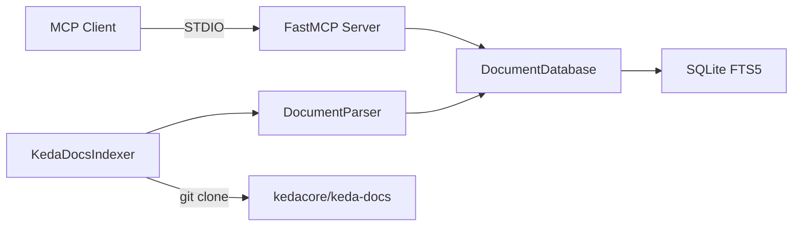

# Claude Code Instructions

## Project Overview

MCP server for KEDA (Kubernetes Event-driven Autoscaling) documentation search and retrieval. Uses SQLite FTS5 for full-text search with BM25 ranking.

## Architecture



### Key Modules

- `models.py` - Data classes: `DocumentMetadata`, `Document`, `SearchResult`
- `database.py` - SQLite FTS5 operations with BM25 ranking
- `parser.py` - TOML frontmatter parsing and TOML FAQ file parsing
- `indexer.py` - Git clone and documentation indexing
- `server.py` - FastMCP server with `search_documentation` and `read_documentation` tools
- `cli.py` - CLI for indexing (`keda-docs-index index`) and stats (`keda-docs-index stats`)

### KEDA-Specific Details

- **Frontmatter**: TOML format (`+++` delimiters) parsed via `python-frontmatter` with `TOMLHandler`
- **Data files**: TOML FAQ files (`data/faq*.toml`) with `[[qna]]` arrays
- **Base URL**: `https://keda.sh`
- **Repository**: `https://github.com/kedacore/keda-docs.git`
- **Content path**: `content/` (no language subdirectory)
- **Sections**: `docs`, `blog`, `troubleshooting`, `faq`, `root`

## Docker Hub Image

The published container image is `martoc/mcp-keda-documentation` on [Docker Hub](https://hub.docker.com/r/martoc/mcp-keda-documentation).

| Property | Value |
|----------|-------|
| Image | `martoc/mcp-keda-documentation` |
| Platforms | `linux/amd64`, `linux/arm64` |
| Base image | `python:3.12-slim` |
| Index | Pre-built at image build time from `kedacore/keda-docs` `main` branch |

```bash
docker run -i --rm martoc/mcp-keda-documentation:latest
```

## Development Commands

```bash
make init       # Initialise environment (uv sync)
make build      # Full build: clean, lint, typecheck, test
make test       # Run tests with coverage
make format     # Format code with ruff
make lint       # Lint with ruff
make typecheck  # Type check with mypy
make index      # Build documentation index from kedacore/keda-docs
make run        # Run MCP server
```

## Code Style

- British English everywhere
- Google-style docstrings
- Type hints on all functions
- See [CODESTYLE.md](CODESTYLE.md) for full details
